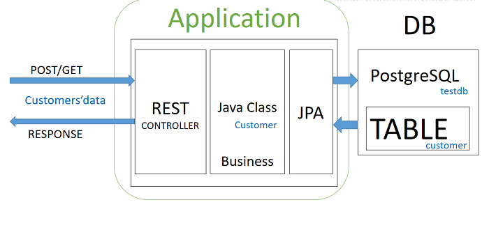

# springboot-postgres-embedded-dao-testing
### About 

This is a sample application to show how to do DAO unit testing using embedded postgres DB
to replicate the same conditions of your production application if you have use postgres DB.

-------------------
###Tech stack:
- Spring boot 2
- Spring data
- Spring REST 
- Lombok
- Postgres
- Mapstruct for DTO mapping
- Swagger 2
-------------------
###How to compile and install:
it is a maven project , so jut clean and install and should be ready ! 
```sh
mvn clean install 
```
-------------------
###How to run the locally :

Once you run the spint boot application locally from the main class, you can test the rest API on the browser via SWAGGER

```sh
http://localhost:8080/swagger-ui.html
```